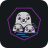
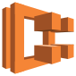
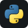
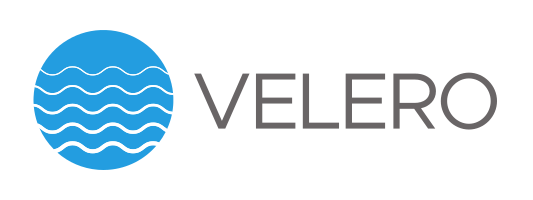

<div align="center">

# Hey, I'm Samuel 👋

**`Infrastructure / DevOps / SysAdmin / Security`**

**💼 Open to Opportunities** — Freelance · Consulting · Full-time · Part-time

</div>

---

## 🖥️ About Me

```yaml
apiVersion: v1
kind: Engineer
metadata:
  name: Samuel
  location: Switzerland
spec:
  roles:
    - DevOps Engineer
    - Infrastucture Engineer
    - System Administrator
    - Security Enthusiast
  focus:
    - Infrastructure as Code
    - Cloud Architecture
    - Container Orchestration
    - Security Hardening
    - Open Source Software
    - Scalibility
  philosophy: "Secure by default, reliable by design, simple by choice"
  uptime: 99.99% # coffee dependent
```

## 🛠️ Tech Stack

<div>

### Infrastructure & Cloud








### Web Servers & Proxies


### Networking & Firewalls\*\*


### Virtualization


### Operating Systems


### Languages & Scripting




### Web & Frameworks


### CI/CD & Version Control


### Databases & Messaging


### Monitoring & Observability


### Security


### Backup




### Project Management & Tools


</div>
